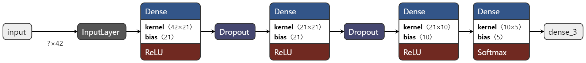
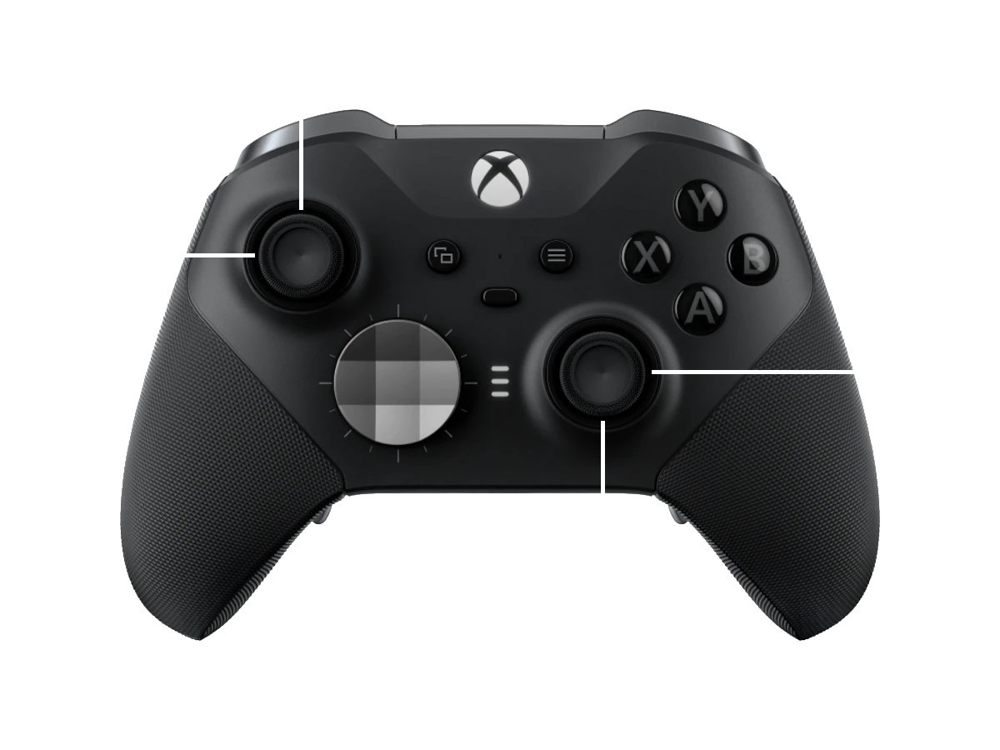
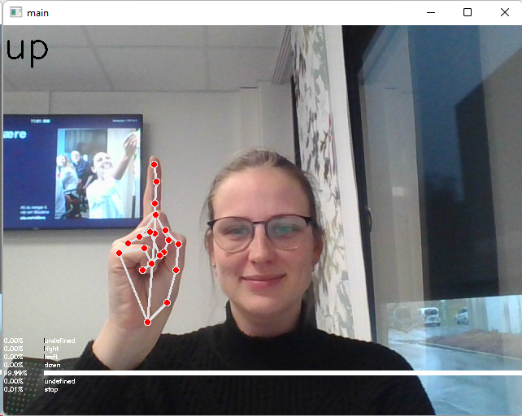
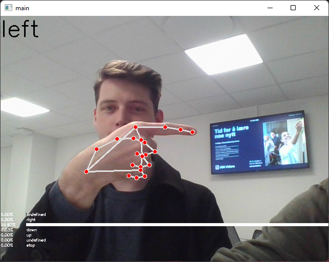
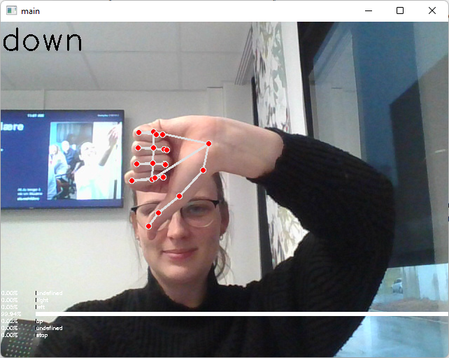
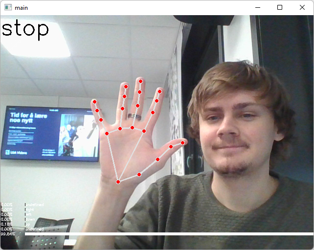
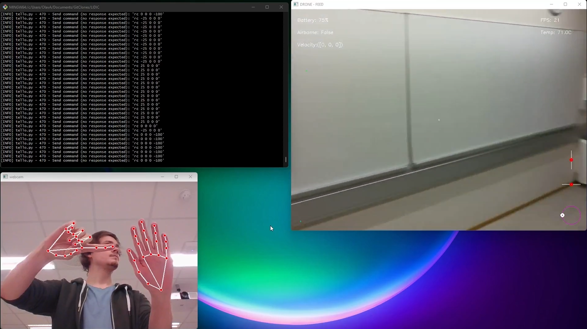

# LIDIC - Live Interactive Drone Imaging Control
This repository is an implementation of machine vision and deep neural networks to
be able to predict hand gestures and control a Tello EDU drone.

The default repository recognizes five different gestures: stop, up, down, left & right.
The default model has an input shape of (42,) and a output shape of (5,) the 5 corresponding to the gestures predicted.



<div style="margin: auto;width:50%;">
    
</div>

```bash
python tello.py -c xbox_controller
```

This repository also allow to control the drone using your keyboard, an xbox controller as well as by gestures,
which is the focus of this repository.


Gestures our model is trained on:
<div style="display:flex;flex-wrap: wrap; justify-content: center; justify-self: center">
    
    
    
    
    
</div>

```bash
python tello.py -c gesture
```

### Combination of gestures results in a  different command:
<div style="background-color:rgba(0, 255, 0, 0.1);padding:10px;border-radius: 10px;
            box-shadow: 0 3px 15px rgba(0,0,0,0.15);">
    <ul>
        <li>Stop + Right: Turn Right</li>
        <li>Stop + Left: Turn Left</li>
        <li>Stop + Up: Forwards</li>
        <li>Stop + Down: Backwards</li>
    </ul>
</div>


## Installation & Use:
```bash
pip install -r requirements.txt
```

```bash
pytthon tello.py -c [keyboard, gesture, xbox_controller]
```

## Demo Video:
[](https://youtu.be/KWKo3OtTaCg "Demo Video")

## [Research Paper](./static/LIDIC.pdf)