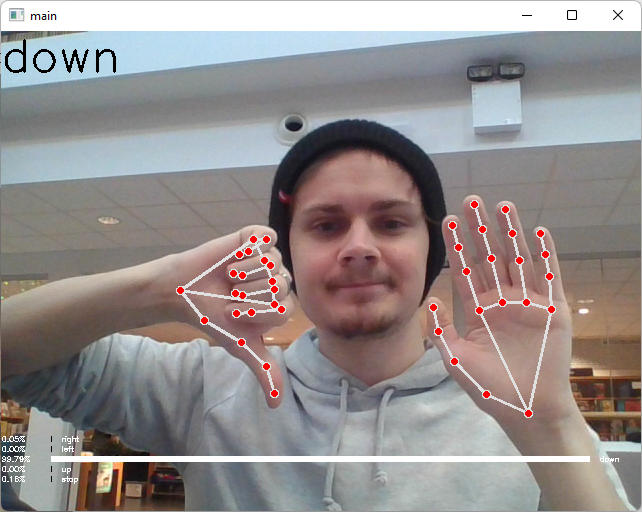
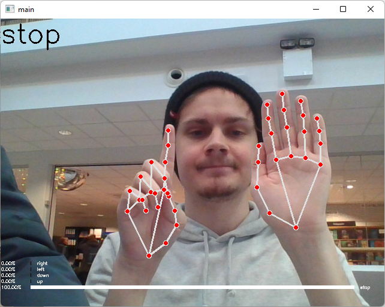
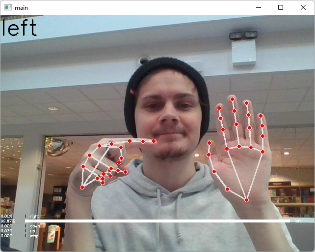
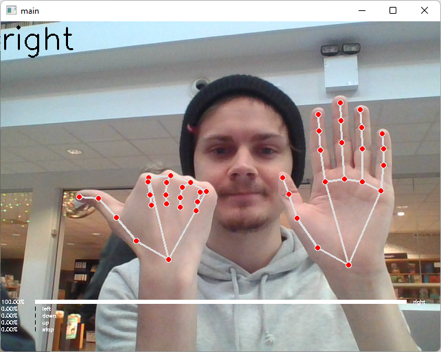

# LIDIC - Live Interactive Drone Imaging Control
This repository is an implementation of machine vision and deep neural networks to
be able to predict hand gestures and control a Tello EDU drone.

The default repository recognizes five different gestures: stop, up, down, left & right.
The default model has an input shape of (42,) and a output shape of (5,) the 5 corresponding to the gestures predicted.


This repository also allow to control the drone using your keyboard, an xbox controller as well as by gestures,
which is the focus of this repository.


## Installation & Use:
1. Install the requirements to be able to run our program, I am using a conda environment for easy setup.  

    ```bash
    pip install -r requirements.txt
    ```
2. Connect your computer to the drone's access point (WIFI).
3. Run the command below to start the program, choose one of the options below in the square brackets.
   ```bash
   pytthon tello.py -c [keyboard, gesture, xbox_controller]
   ```
4. Controller Types:
    <div>
        <ol>
            <li><b>Xbox Controller:</b></li>
            <div style="margin-top:25px; margin-bottom: 25px;width:50%;background-color:rgba(0, 0, 0, 0.1); border-radius: 10px;
                        box-shadow: 0 3px 15px rgba(0,0,0,0.3);justify-content: flex-start;">
                
            </div>
            <li><b>Keyboard:</b>
               <div style="box-shadow: 0 3px 15px rgba(0,0,0,0.3);padding: 10px;border-radius: 10px;">
                    A - Left<br/>
                    D - Right<br/>
                    W - Forward<br/>
                    S - Backwards<br/>
                    X - Takeoff / Land
                    R - Reset RC (ZERO WHEN YOU WANT TO STAY STILL)
               </div>
            </li>
            <li><b>Gesture</b>
                <div style="box-shadow: 0 3px 15px rgba(0,0,0,0.3);padding: 10px;border-radius: 10px;">
                    Stop = Takeoff / Land<br/>
                    Hike Right = Go Right<br/>
                    Point Left = Go Left<br/>
                    Point Up = Go Up<br/>
                    Thumbs Down = Go Down<br/><br/>
                    <div style="display:flex;flex-wrap: wrap; justify-content: flex-start; justify-self: center">
                        
                        
                        
                        
                        
                    </div>
                    <b> Multi Commands:</b><br/>
                    Stop + Hike Right = Rotate Right<br/>
                    Stop + Point Left = Rotate Left<br/>
                    Stop + Point Up = Forward<br/>
                    Stop + Thumbs Down = Backwards<br/>
                    <div style="display:flex;flex-wrap: wrap; justify-content: flex-start; justify-self: center">
                       
                       
                       
                       
                    </div>
                </div>
            </li>
        </ol>
    </div>

## Demo Video:
[](https://youtu.be/KWKo3OtTaCg "Demo Video")

## [Research Paper](./static/LIDIC.pdf)